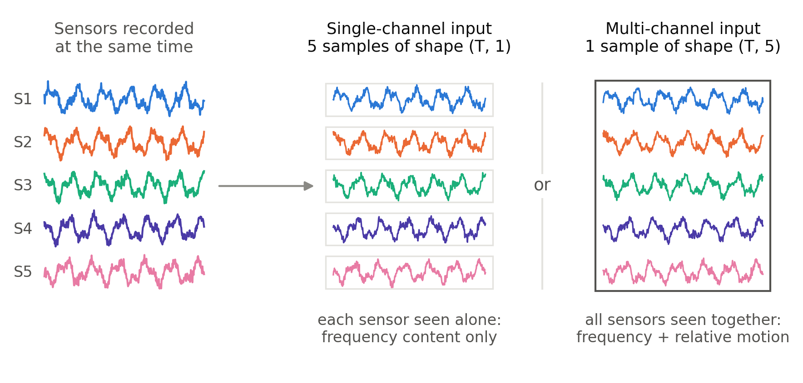
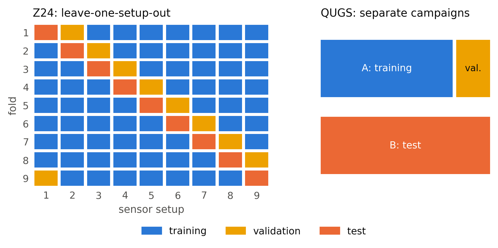
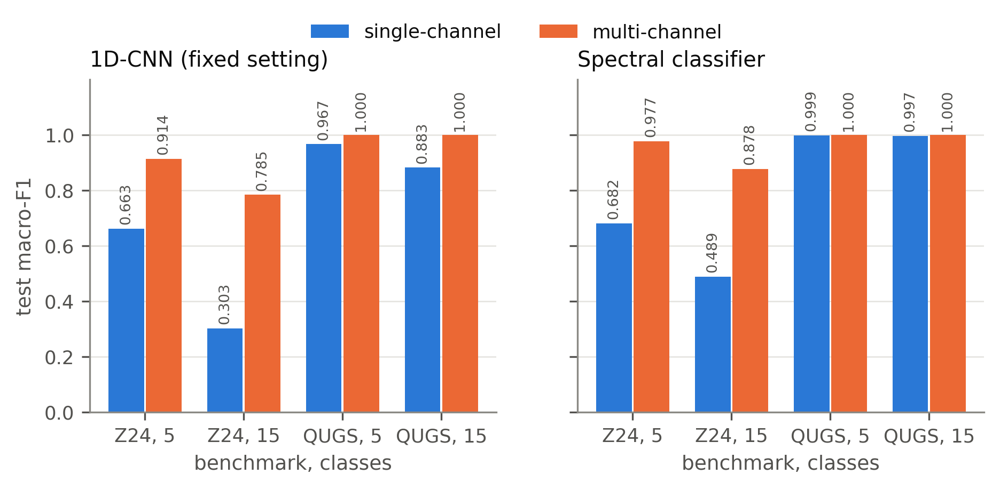
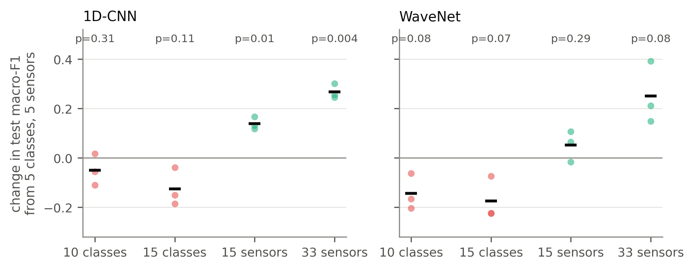
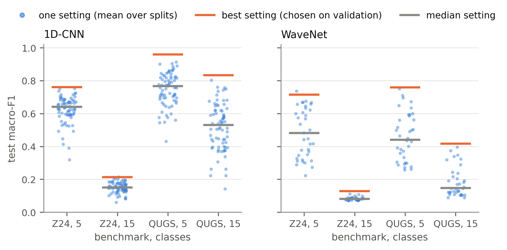
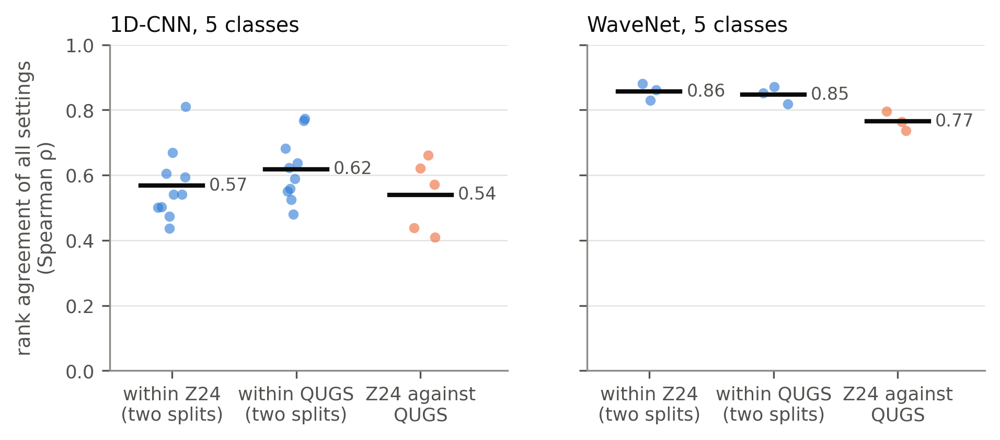
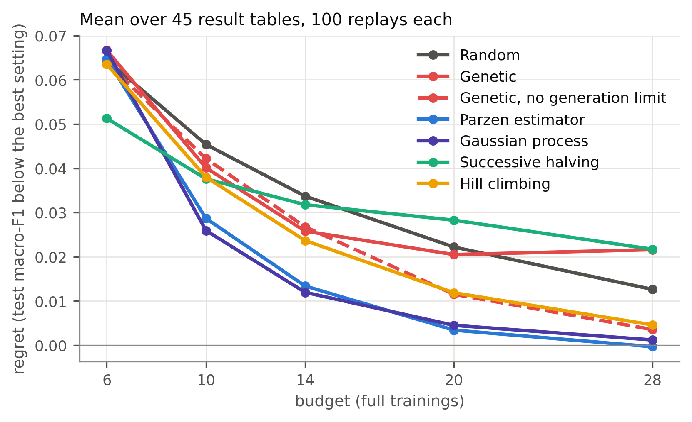

# Relative importance of input formulation and hyperparameter optimisation in vibration-based structural health monitoring

## Abstract

Deep models for vibration-based damage detection are often improved by tuning their hyperparameters, for example with a genetic algorithm. This paper asks how much that tuning matters compared with a simpler decision: how the sensor signals are presented to the model. Using the Z24 bridge and the QUGS grandstand benchmarks, with training and test data always taken from different measurements, we compare three design decisions: (i) a multi-channel input, in which all sensors recorded at the same time are presented to the model together, against a single-channel input, in which each sensor is presented separately; (ii) tuning the hyperparameters; and (iii) the choice of search algorithm used for tuning. The multi-channel input has by far the largest effect: on the 15-class Z24 problem, macro-F1 rises from 0.30 to 0.78, and a simple spectral classifier improves by a similar amount, which shows that the gain comes from the extra information in the input and not from the model. Choosing the best hyperparameter setting instead of a typical one raises macro-F1 by a further 0.12 to 0.32 in six of eight cases. The search algorithm matters least: when ten or more trainings are allowed, Bayesian optimisation finds settings closer to the best one than random or genetic search does with the same number of trainings. This order follows from what each decision controls: a model cannot learn what is not in its input, tuning only helps the model use the information it already has, and the search algorithm only changes how quickly well-performing settings are found. Finally, the best settings found on one benchmark give the same accuracy on the other benchmark as settings tuned there directly, provided the network performs well on the benchmark used for tuning, so tuning does not need to be repeated for each new structure.

## 1 Introduction

Vibration-based structural health monitoring detects damage from the way a structure vibrates. Deep neural networks are now widely used for this task because they can learn directly from raw acceleration signals, without hand-crafted features. Building such a network, however, requires three decisions before any training starts. The first is how the sensor signals are presented to the network. The second is which hyperparameters it uses, such as the learning rate and the size of the network. The third is which search algorithm is used to find well-performing hyperparameters.

Among these decisions, the search for hyperparameters has received the most attention, and genetic algorithms in particular are often recommended for it. Yet the three decisions are not equally important, for a reason that follows from what each one controls. The input determines what information is available to the network, and no network can learn what is not in its input. The hyperparameters determine how effectively the network uses that information. The search algorithm does not change which setting is best; it only changes how many trainings are needed to find it.

This reasoning predicts a clear order of importance: the input first, the hyperparameters second and the search algorithm last. If the prediction holds, a practitioner with limited computing time should spend it in the same order. To our knowledge, however, the three decisions have not been compared in the same experiments, on the same data and with the same scoring, so the size of each effect is not known.

This paper makes that comparison on two standard benchmarks, the Z24 bridge and the QUGS laboratory frame. Training and test data are always taken from different measurements, so that the scores reflect performance on new data. Two network designs are used, every hyperparameter setting in the search space is trained, and seven search algorithms are then compared on these results at exactly the same cost.

The results confirm the predicted order. Presenting all sensors to the network together raises 15-class macro-F1 on Z24 from 0.30 to 0.78; choosing the best hyperparameter setting instead of a typical one raises it by a further 0.12 to 0.32 in six of eight cases; and the choice of search algorithm changes it by only about 0.02. Section 2 reviews related work and Section 3 describes the data, the evaluation and the models. Section 4 presents the results for each decision in turn, and Sections 5 and 6 discuss what they mean in practice.

## 2 Related work

Damage reduces the stiffness of a structure and so changes both its natural frequencies and its mode shapes. Frequencies can be measured with one sensor, whereas mode shapes require several sensors recorded at the same time (Doebling et al., 1996; Fan and Qiao, 2011). On real structures, temperature and other environmental effects also change the frequencies, sometimes by more than damage does, as shown on the Z24 bridge (Peeters and De Roeck, 2001). Z24 (Maeck and De Roeck, 2003; Reynders and De Roeck, 2009) and the QUGS laboratory frame (Abdeljaber et al., 2017) are standard benchmarks for studying this problem.

Deep learning has been applied to these benchmarks in several forms. Convolutional networks applied directly to acceleration signals are well established for damage detection (Abdeljaber et al., 2017), as are dilated-convolution models such as WaveNet (van den Oord et al., 2016; Dabbous et al., 2024). Both input conventions are used in practice. Abdeljaber et al. (2017) trained a separate network on the signal of each sensor, and Teng et al. (2021) compared one network that receives all sensor signals together with several per-sensor networks whose decisions are combined. The choice between them determines what information the network receives, yet it has received far less attention than the tuning of hyperparameters.

The hyperparameters of these networks are tuned with random search (Bergstra and Bengio, 2012), with Bayesian methods that use earlier results to choose the next trial (Bergstra et al., 2011; Snoek et al., 2012), with methods that stop poor settings early (Li et al., 2018), or, often in structural health monitoring, with genetic algorithms (Lee et al., 2021; Santos et al., 2017). In general machine learning, studies have measured how much tuning improves a model and which hyperparameters matter (Probst et al., 2019; van Rijn and Hutter, 2018). Others have asked whether well-performing settings carry over between datasets (Wistuba et al., 2015, 2016). This question differs from domain adaptation, which reuses a trained model on new data (Rezazadeh et al., 2026). Search methods are often compared on tables of results trained in advance, so that every method sees exactly the same outcomes (Ying et al., 2019; Klein and Hutter, 2019; Eggensperger et al., 2021).

Any such comparison is only as reliable as its test scores. Test scores, in turn, are reliable only if training and test data are truly independent, and this condition is easily broken when samples are cut from the same recording (Kapoor and Narayanan, 2023). The input, the hyperparameters and the search method have each been studied separately. Their effects have not yet been compared on the same vibration data with independent test sets, and this paper makes that comparison.

## 3 Methods

### 3.1 Datasets and scenarios

The choice of input follows from what damage does to a structure. Damage makes part of the structure less stiff, which changes its natural frequencies and its mode shapes. A frequency change can be seen from any single sensor. A mode-shape change, however, concerns how different points of the structure move relative to each other, so it can only be seen by comparing several sensors recorded at the same time. A single-channel input therefore shows the network only frequency information, while a multi-channel input shows it both kinds of information (Figure 1).

**Figure 1.** The two input formulations. The same five simultaneously recorded signals are presented to the network either as five separate samples of shape (T, 1) or as one sample of shape (T, 5).

The first benchmark, Z24, is a full-scale concrete bridge in Switzerland that was damaged step by step before demolition. It contains fifteen damage states, each measured in nine sensor setups at 100 Hz. The sensors were relocated between setups, except for five reference sensors that remained at the same positions in every setup.

The second benchmark, QUGS, is a laboratory steel frame that represents a stadium grandstand. It contains 31 states — the undamaged frame and one loosened bolt at each of its thirty joints — measured with thirty accelerometers at 1024 Hz in two separate measurement campaigns.

Both benchmarks are used with five and with fifteen classes, giving four scenarios, and all signals are cut into windows of 2048 samples (Table 1). In the single-channel input, each sensor's window is a separate sample of shape (T, 1). In the multi-channel input, the windows of several sensors at the same time form one sample of shape (T, C). On Z24 the multi-channel input uses only the five fixed sensors, so that each channel always refers to the same position on the bridge. On QUGS, whose sensors never move, it uses five or fifteen sensors.

**Table 1.** The two benchmarks and how they are used.

| | Z24 | QUGS |
|---|---|---|
| Structure | Concrete box-girder bridge, Switzerland | Laboratory steel frame (grandstand simulator) |
| Damage | Progressive damage, applied step by step | One loosened bolt at one of 30 joints |
| States | 15 damage states | 31 (undamaged + 30 bolt locations) |
| Classes used | 5 and 15 | 5 and 15 |
| Repeated measurements | 9 sensor setups per state | 2 campaigns (A and B) |
| Accelerometers | 27–33 per setup, 5 fixed in all setups | 30, fixed at the joints |
| Sampling rate | 100 Hz | 1024 Hz |
| Window of 2048 samples | 20.5 s | 2.0 s |
| Sensors in single-channel input | 5 fixed (5 classes); all 27–33 (15 classes) | 5 or 15 |
| Sensors in multi-channel input | 5 (the fixed ones) | 5 or 15 |
| Test data | Held-out sensor setups | Campaign B |

### 3.2 Evaluation protocol

These data must be split with care, because a test score is only meaningful if the test data are new to the network. Windows cut from the same measurement are not new to each other: they share the same excitation, the same sensor settings and the same weather. A network can therefore learn to recognise which measurement a window came from and guess its label from that, without learning anything about damage.

To prevent this, whole measurements are always kept together, either all in training or all in testing. On Z24, whole sensor setups are held out for testing. The main experiments use a different random choice of setups for each split. The reference results of Section 4.4 hold out each of the nine setups in turn, which is known as leave-one-setup-out cross-validation. On QUGS, the network is trained on campaign A and tested on campaign B (Figure 2).

**Figure 2.** How the data are split. On Z24 each fold holds out one whole sensor setup for testing and the next one for validation; on QUGS training and validation use campaign A and testing uses all of campaign B.

Two further safeguards support this split. Each window records which measurement it came from, and the code checks automatically, every time the data are loaded, that no measurement appears in both training and testing. Each window is also normalised on its own, which removes its overall amplitude; amplitude mainly identifies the measurement rather than the damage, and removing it improves accuracy on new measurements.

### 3.3 Models and search spaces

Different network architectures favour different patterns, so a result found with only one design might be a property of that design rather than of the problem. Every experiment is therefore repeated with two designs, and a conclusion is drawn only where both agree or where the difference between them is itself explained.

The first design is a WaveNet, which uses stacks of dilated convolutions to see long stretches of signal; it was carried over from an earlier Keras implementation, including its weight initialisation. The second is a simpler one-dimensional convolutional network (1D-CNN), which shortens the signal step by step through pooling and averages over time before the final classification. Both are trained for 40 epochs with a batch size of 64.

Each design has four hyperparameters: the learning rate, the number of filters, and two settings that control the structure of the network (Table 2). Together they give 72 possible settings. All 72 were trained for the 1D-CNN. For the slower WaveNet, a balanced half of 36 was trained, in which every value of every hyperparameter appears equally often, so that its effect can still be measured.

**Table 2.** Hyperparameters and the values searched. Each design has 3 × 3 × 2 × 4 = 72 settings.

| WaveNet | Values | 1D-CNN | Values |
|---|---|---|---|
| Learning rate | 3×10⁻⁵, 10⁻⁴, 3×10⁻⁴, 10⁻³ | Learning rate | 3×10⁻⁵, 10⁻⁴, 3×10⁻⁴, 10⁻³ |
| Filters | 4, 8, 16 | Filters | 8, 16, 32 |
| Dilated layers per block | 6, 8, 10 | Convolutional blocks | 3, 4, 5 |
| Blocks | 1, 2 | Kernel size | 5, 9 |

### 3.4 Metrics

Once every setting is trained, the best one must be chosen on one set of data and scored on another; otherwise the score is too optimistic. Settings are therefore chosen on a validation set and scored on a separate test set. The main score is macro-F1, the average F1 over all classes, which counts every class equally even when some classes have fewer samples.

To tell whether a gain comes from the input or from the network, a simple reference classifier is also trained: logistic regression on the frequency spectrum of each window. Because this classifier has no deep layers and no hyperparameters to tune, its score shows how much class information the input itself contains.

Finally, comparisons are made on the same data splits, so that differences caused by the split cancel out. For the search algorithms, cost is counted as the number of full trainings used. Quality is measured by the regret, the gap between the test score of the setting an algorithm finds and that of the best setting in the table.

## 4 Results

### 4.1 Effect of the input formulation

If the multi-channel input provides the network with more information, accuracy should rise for every classifier, not only for one design. This is what is observed (Table 3, Figure 3). On Z24, the multi-channel input raises the 1D-CNN's macro-F1 from 0.30 to 0.78 with fifteen classes and from 0.66 to 0.91 with five. On QUGS both inputs already score highly, and the multi-channel input reaches 1.000.

**Table 3.** Test macro-F1 with single-channel and multi-channel input. The 1D-CNN uses one fixed setting (learning rate 10⁻³, 32 filters, 4 blocks, kernel size 9); the spectral classifier is logistic regression on the frequency spectrum.[^t3]

[^t3]: The single-channel 15-class Z24 value here (0.303) is higher than the best tuned value in Table 5 (0.213) because the two experiments use different amounts of data. Table 3 trains one fixed setting on windows taken close together (14,365 training windows), whereas the tuning grid of Table 5 takes windows further apart (11,584 training windows) to keep the search over 72 settings affordable, and reports the mean over three splits rather than a single split. Values are comparable within each table, not across them.

| Benchmark | Classes | 1D-CNN, single | 1D-CNN, multi | Spectral, single | Spectral, multi |
|---|---|---|---|---|---|
| Z24 | 5 | 0.663 | **0.914** | 0.682 | 0.977 |
| Z24 | 15 | 0.303 | **0.785** | 0.489 | 0.878 |
| QUGS | 5 | 0.967 | 1.000 | 0.999 | 1.000 |
| QUGS | 15 | 0.883 | 1.000 | 0.997 | 1.000 |

**Figure 3.** Test macro-F1 with single-channel and multi-channel input, for the 1D-CNN (left) and the spectral classifier (right). Both improve on Z24, which shows that the multi-channel input adds information rather than model capacity.

The reference classifier confirms that the gain comes from the input. With the same change, logistic regression on the spectrum rises from 0.49 to 0.88 on the 15-class Z24 problem. A simple classifier with fixed features cannot become more powerful, so its gain can only come from new information, namely how the sensors move relative to each other. The gain also appears even though the multi-channel input leaves fewer training samples: on the 5-class Z24 problem, 954 instead of 4,770, because one sample now holds all sensors.

The number of sensors matters even with single-channel input, and it acts in the opposite direction to the number of classes (Table 4, Figure 4). The baseline is five classes and five sensors on Z24. Taking samples from fifteen or thirty-three sensors instead of five raises the 1D-CNN's macro-F1 by 0.14 (p = 0.011) and 0.27 (p = 0.004), because the training data then cover more positions on the structure. Adding classes lowers it, by 0.13 for the 1D-CNN and 0.17 for the WaveNet at fifteen classes, a drop seen in every run although not statistically significant with three runs. More sensors therefore make the task easier, while more classes make it harder.

**Table 4.** Change in test macro-F1 of the best setting from a baseline of five classes and five sensors on Z24, single-channel input, mean over three paired splits.

| Change from baseline | 1D-CNN | p | WaveNet | p |
|---|---|---|---|---|
| 10 classes | −0.05 | 0.31 | −0.14 | 0.08 |
| 15 classes | −0.13 | 0.11 | −0.17 | 0.07 |
| 15 sensors | **+0.14** | **0.011** | +0.05 | 0.29 |
| 33 sensors | **+0.27** | **0.004** | +0.25 | 0.08 |

**Figure 4.** Change in test macro-F1 when the number of classes or of sensors is increased from a baseline of five classes and five sensors (Z24, single-channel input). Dots are individual splits; bars are means. More classes lower the score, more sensors raise it.

How much of the extra information a network uses depends on its design. The WaveNet benefits much less from the multi-channel input than the 1D-CNN. On the 15-class Z24 problem its macro-F1 rises only from 0.13 to 0.22. On the 5-class problem it changes little on random splits (0.72 in both cases) and is lower under leave-one-setup-out testing (0.71 against 0.79; Table 8). The information is in the input, but not every design is able to exploit it.

### 4.2 Effect of hyperparameter tuning

Once the input is fixed, tuning cannot add information; it can only help the network use what the input already contains. To measure how much it helps, the best setting, chosen on the validation set, is compared with a typical setting, taken as the median of all settings tried, both scored on the test set.

There are eight cases: four scenarios times two network designs (Table 5, Figure 5). In six of them, the best setting is better than the typical one by 0.12 to 0.32 macro-F1, and the difference is statistically significant. For example, on QUGS with fifteen classes the 1D-CNN reaches 0.53 with a typical setting and 0.83 with the best one. The two exceptions are both the 15-class Z24 problem with single-channel input, where no setting performs well (macro-F1 below 0.22), so there is little to gain by choosing between them.

**Table 5.** Test macro-F1 of the best setting (chosen on validation data) and of the median setting, single-channel input, paired by split.

| Design | Benchmark | Classes | Best | Median | Gain | p |
|---|---|---|---|---|---|---|
| 1D-CNN | Z24 | 5 | 0.760 | 0.641 | **+0.120** | 0.002 |
| 1D-CNN | Z24 | 15 | 0.213 | 0.150 | +0.063 | 0.179 |
| 1D-CNN | QUGS | 5 | 0.958 | 0.767 | **+0.191** | <0.001 |
| 1D-CNN | QUGS | 15 | 0.833 | 0.529 | **+0.303** | 0.013 |
| WaveNet | Z24 | 5 | 0.715 | 0.481 | **+0.233** | 0.021 |
| WaveNet | Z24 | 15 | 0.128 | 0.081 | +0.047 | 0.126 |
| WaveNet | QUGS | 5 | 0.759 | 0.441 | **+0.319** | 0.028 |
| WaveNet | QUGS | 15 | 0.417 | 0.147 | **+0.270** | 0.011 |

**Figure 5.** Test macro-F1 of every hyperparameter setting (dots, mean over splits), with the best setting chosen on validation data (orange) and the median setting (grey). The gap between the two lines is the value of tuning.

Since tuning matters, the next question is whether it must be repeated for every structure. With five classes it need not. Taking the best setting from the other benchmark, instead of tuning on the target benchmark, loses between 0.01 and 0.08 macro-F1, and none of these losses is statistically significant (p between 0.15 and 0.76 for the four combinations of design and target). With fifteen classes the result depends on the source. Settings chosen on the 15-class Z24 problem, where no setting performs well, lose 0.19 on QUGS for the 1D-CNN (p = 0.001). In the other three 15-class combinations the loss is 0.03 to 0.06 and not significant. A setting should therefore be transferred only from a benchmark on which the network performs well.

The ranking of all settings shows the same pattern (Table 6, Figure 6). With five classes, the ranking of settings on Z24 agrees with that on QUGS almost as closely as two random splits of the same benchmark agree with each other. The rank correlation is 0.54 against 0.57–0.62 for the 1D-CNN, and 0.77 against 0.85–0.86 for the WaveNet. Moving to a different structure therefore changes the ranking only slightly more than re-splitting the same data does. The small extra change is clearer for the WaveNet, whose rankings are more repeatable, than for the 1D-CNN, whose split-to-split variation is large enough to hide it. With fifteen classes the comparison is less clean, because the WaveNet's 15-class Z24 ranking is itself poorly repeatable (0.24), as no setting performs well there.

**Table 6.** Agreement between rankings of all settings (Spearman rank correlation of test macro-F1), within one benchmark and between the two benchmarks, mean over pairs of splits.

| Design | Classes | Within Z24 | Within QUGS | Z24 against QUGS |
|---|---|---|---|---|
| 1D-CNN | 5 | 0.57 | 0.62 | 0.54 |
| 1D-CNN | 15 | 0.69 | 0.81 | 0.59 |
| WaveNet | 5 | 0.86 | 0.85 | 0.77 |
| WaveNet | 15 | 0.24 | 0.69 | 0.41 |

**Figure 6.** Rank agreement of all settings with five classes: between two splits of the same benchmark (blue) and between Z24 and QUGS (orange). Each dot is one pair of splits; bars are means.

### 4.3 Comparison of search strategies

Because every setting was trained in advance and its score after every epoch was saved, any search algorithm can be replayed exactly on these results without new training. Seven algorithms were compared in this way at the same cost. They are random search; a genetic algorithm with a population of eight over four generations, and the same algorithm without the generation limit; two Bayesian methods, the tree-structured Parzen estimator and Gaussian-process optimisation; successive halving; and hill climbing. Each was replayed one hundred times on each of 45 result tables (Table 7, Figure 7).

**Table 7.** Regret (gap in test macro-F1 to the best setting; lower is better) at each budget, in full trainings, mean over 45 result tables and 100 replays. Best value per budget in bold.

| Budget | Random | Genetic | Genetic, no generation limit | Parzen estimator | Gaussian process | Successive halving | Hill climbing |
|---|---|---|---|---|---|---|---|
| 6 | 0.065 | 0.067 | 0.064 | 0.065 | 0.067 | **0.051** | 0.064 |
| 10 | 0.045 | 0.040 | 0.042 | 0.029 | **0.026** | 0.038 | 0.038 |
| 14 | 0.034 | 0.026 | 0.027 | 0.013 | **0.012** | 0.032 | 0.024 |
| 20 | 0.022 | 0.021 | 0.012 | **0.003** | 0.005 | 0.028 | 0.012 |
| 28 | 0.013 | 0.022 | 0.004 | **0.000** | 0.001 | 0.022 | 0.005 |

**Figure 7.** Regret of the seven search algorithms against the budget. Successive halving is best at six trainings, the two Bayesian methods from ten trainings onward, and the genetic algorithm with a fixed number of generations stops improving after about sixteen trainings.

The results depend on the budget, as expected, because an algorithm can only beat random search by learning from the results it has already seen. With a budget of only six full trainings, which is 8% of the 1D-CNN's settings and 17% of the WaveNet's, too few results are available to guide the search, and the Bayesian methods do no better than random search. Only successive halving does better, because it trains many settings for a few epochs instead of a few settings to the end. It finds the true best setting in 25% of runs, against 11–13% for the others.

From about ten trainings onward, enough results are available, and the Bayesian methods are consistently best. After fourteen trainings their regret is 0.012 and 0.013, against 0.034 for random search, and after twenty trainings the tree-structured Parzen estimator reaches 0.003.

The genetic algorithm is limited by its schedule rather than by its principle. With a population of eight over four generations it can try only about sixteen different settings, so it cannot use a larger budget. At twenty-eight trainings, random search overtakes it (regret 0.013 against 0.022). Removing the generation limit, without any other change, reduces its regret to 0.004, but even then it remains behind the Bayesian methods.

### 4.4 Reference results on Z24 and QUGS

In addition, the experiments provide reference scores for both benchmarks under the strict split of Section 3.2 (Table 8). On Z24, with leave-one-setup-out testing, the 1D-CNN with multi-channel input reaches a test accuracy of 0.966 ± 0.039 with five classes and 0.665 ± 0.087 with fifteen. With single-channel input the scores are much lower, 0.786 and 0.286. In that case the simple spectral classifier performs as well as the deep networks or better (Table 3), as expected when the input contains little more than frequency information.

**Table 8.** Reference results on Z24 with leave-one-setup-out cross-validation (mean ± 95% confidence interval over nine folds). In the single-channel 15-class case the 1D-CNN uses all sensors of each setup and the WaveNet the five fixed sensors.

| Design | Classes | Input | Test accuracy | Macro-F1 |
|---|---|---|---|---|
| 1D-CNN | 5 | Multi-channel | **0.966 ± 0.039** | **0.964 ± 0.042** |
| 1D-CNN | 5 | Single-channel | 0.786 ± 0.055 | 0.781 ± 0.057 |
| WaveNet | 5 | Multi-channel | 0.716 ± 0.074 | 0.713 ± 0.074 |
| WaveNet | 5 | Single-channel | 0.792 ± 0.031 | 0.790 ± 0.030 |
| 1D-CNN | 15 | Multi-channel | **0.665 ± 0.087** | **0.640 ± 0.096** |
| 1D-CNN | 15 | Single-channel | 0.286 ± 0.058 | 0.264 ± 0.063 |
| WaveNet | 15 | Multi-channel | 0.235 ± 0.027 | 0.229 ± 0.028 |
| WaveNet | 15 | Single-channel | 0.148 ± 0.019 | 0.146 ± 0.017 |

QUGS represents the opposite case (Table 9). The simple spectral classifier, using only one sensor, already reaches 0.999 macro-F1 on all 31 states of the held-out campaign. When even the simplest method is almost perfect, no network or hyperparameter setting can do better. With multi-channel input, 45 of the 72 1D-CNN settings reach this ceiling with five classes and 29 of 72 with fifteen. QUGS with multi-channel input is therefore not used to compare settings.

**Table 9.** QUGS, all 31 states: test macro-F1 on campaign B against the number of sensors in the input.

| Sensors | 1D-CNN | Spectral classifier |
|---|---|---|
| 1 | 0.987 | 0.999 |
| 2 | 0.999 | 1.000 |
| 3 | 1.000 | 1.000 |
| 30 | 1.000 | 1.000 |

The contrast between the two benchmarks has a likely explanation, although these data do not test it. The laboratory frame is excited in a controlled way, so the frequency changes caused by a loosened bolt stand out clearly. On the full-scale bridge, temperature and other environmental effects also change the frequencies, so frequency alone is not enough, and the information carried by several sensors together becomes necessary.

## 5 Discussion

Taken together, the results follow the order predicted in the introduction (Table 10). Changing to a multi-channel input, which gives the network more information, raises 15-class macro-F1 on Z24 by about 0.48, from 0.30 to 0.78. Choosing the best hyperparameter setting instead of a typical one, which helps the network use that information, raises macro-F1 by 0.12 to 0.32 in six of eight cases. Using a Bayesian method instead of random search with the same number of trainings, which only brings the search closer to the best setting, improves macro-F1 by about 0.02. Tuning on a different benchmark instead of the target one makes no measurable difference with five classes, provided the network performs well on that benchmark. Using a genetic algorithm instead of random search changes the regret by less than 0.01 in either direction.

**Table 10.** Size of each effect, in test macro-F1.

| Decision | What it changes | Effect |
|---|---|---|
| Multi-channel instead of single-channel input | Information available to the network | +0.48 (Z24, 15 classes) |
| Best instead of typical hyperparameters | How well the information is used | +0.12 to +0.32 |
| Bayesian instead of random search, same cost | How quickly a well-performing setting is found | about +0.02 |
| Tuning on the target instead of another benchmark | — | not measurable (5 classes); up to +0.19 when the source is a problem the network cannot learn |
| Genetic instead of random search, same cost | — | −0.01 to +0.01, depending on budget |

This order suggests where effort is best spent in practice. First, keep whole measurements together when splitting the data, so that the test score can be trusted. Second, present all sensors to the network together when they are recorded at the same time and at fixed positions. Third, tune once with a Bayesian method, possibly on a different but similar structure on which the network performs well, and check that the search schedule can use the full budget allocated to it. Finally, report macro-F1 on held-out measurements together with a simple spectral classifier, which shows how much information the input contains.

The use of two network designs proved necessary for reaching these conclusions. The small cost of transferring settings between benchmarks was clear only with the WaveNet, whose results are more repeatable. Conversely, the benefit of the multi-channel input was large for the 1D-CNN but small for the WaveNet. A study using only one design would have reached a simpler, and in each case incomplete, conclusion.

The main limitation is the number of benchmarks. Only two were used, and one of them, QUGS, is saturated with multi-channel input and cannot rank settings, so the comparison between datasets rests on a single pair and on the single-channel input. A third benchmark with repeated measurements, many sensors recorded together and real environmental variation would give a stronger test of the conclusions.

## 6 Conclusion

A network cannot learn what is not in its input, tuning helps it use what is there, and the search algorithm only changes how quickly well-performing settings are found. On two vibration benchmarks, tested with training and test data from different measurements, the measured effects follow this order. A multi-channel input raises 15-class macro-F1 on Z24 from 0.30 to 0.78. Choosing the best hyperparameter setting instead of a typical one raises macro-F1 by a further 0.12 to 0.32 in six of eight cases. The choice of search algorithm changes the result by only about 0.02.

Two practical findings follow. First, the best settings found on one benchmark work equally well on the other when the network performs well on both, so tuning does not need to be repeated for each structure. Second, if ten or more trainings can be afforded for tuning, Bayesian optimisation is preferable to random or genetic search, because it finds settings closer to the best one for the same number of trainings. For damage detection from vibration, the most valuable decision is therefore how the sensor signals are presented to the network.
